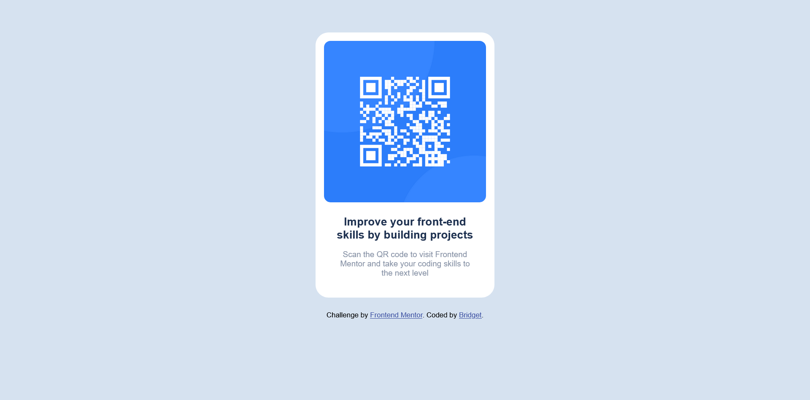
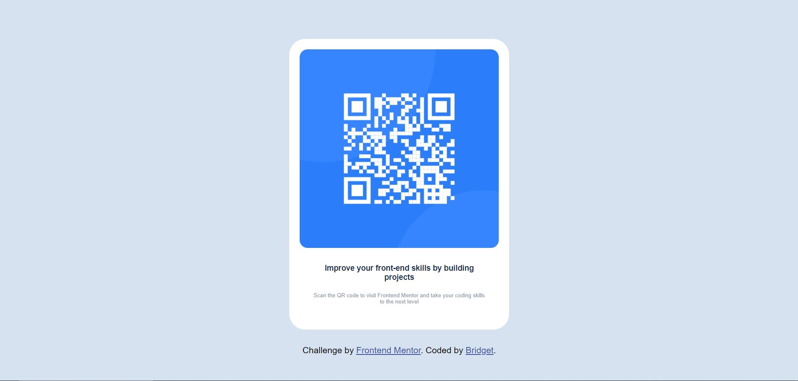
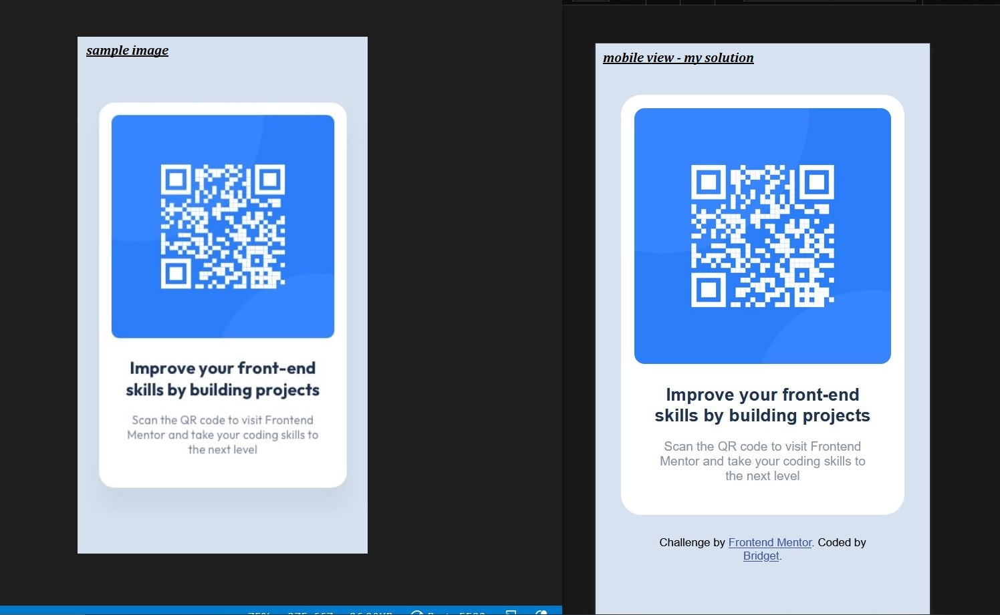

# Frontend Mentor - QR code component solution

This is a solution to the [QR code component challenge on Frontend Mentor](https://www.frontendmentor.io/challenges/qr-code-component-iux_sIO_H). Frontend Mentor challenges help you improve your coding skills by building realistic projects.

## Table of contents

- [Overview](#overview)
  - [Screenshot](#screenshot)
  - [Links](#links)
- [My process](#my-process)
  - [Built with](#built-with)
  - [What I learned](#what-i-learned)
  - [Continued development](#continued-development)
- [Author](#author)
- [Acknowledgments](#acknowledgments)

## Overview

### Screenshot

<!--  -->

### Links

- Solution URL: [Link to my solution git repo](https://github.com/breeMudi/qr-component-challenge/tree/main)
- Live Site URL: [Link to project view on git-hub live server](https://breemudi.github.io/qr-component-challenge/)

## My process

### Built with

- Semantic HTML5 markup
- CSS custom properties
- Flexbox
- CSS Grid
- Mobile-first workflow
- [Styled Components](https://styled-components.com/) - For styles

### What I learned

Through this exercise, I understood the importance of setting {margin: auto} to target divs in CSS especially after initializing margin as 0 at the root html level.

I however noticed that the webpage viewed differently in chrome (Below!) when compared with firefox (Above!)

.

This project was carried out with a mobile-first approach. The picture below shows the camparison of the exercise as given in the frontend Mentor site and The outlook of my project in mobile view

.

### Continued development

I hope to find and reduce redundant code in the css file.
In the nearest future, Will create a series where I attempt 20 more frontend Mentor challenges in another git repository. This I believe will help me grasp the importance of more concepts in html, css and javascript.

## Author

- Frontend Mentor - [@breeMudi](https://www.frontendmentor.io/profile/breeMudi)
- Twitter - [@Bridgetmudiaga](https://www.twitter.com/Bridgetmudiaga)

## Acknowledgments

Special thanks to Zach Goll (https://github.com/zachgoll/fullstack-roadmap-series) for his wonderful introduction to webdevelopment Bootcamp

